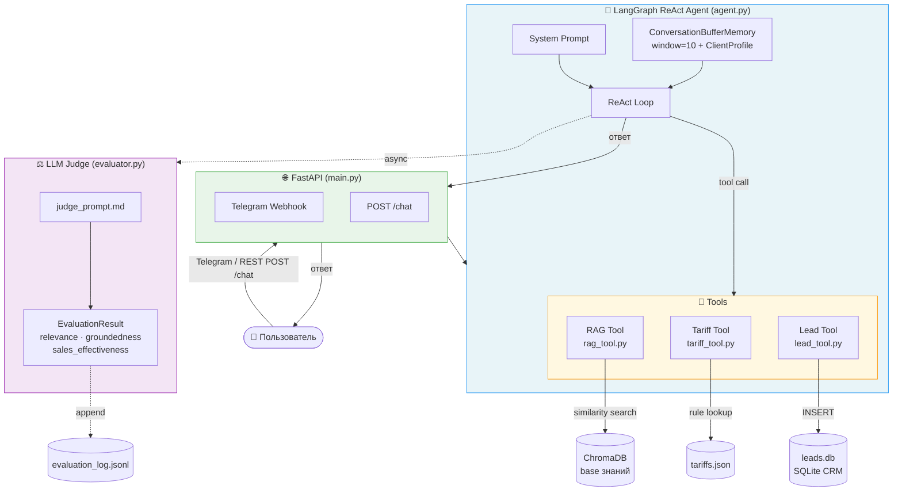

# AI Sales Assistant для банковских продуктов МСБ

Прототип AI-ассистента для продажи банковских продуктов малому и среднему бизнесу (РКО, эквайринг, кредиты) через Telegram или REST API. Агент квалифицирует клиента, извлекает информацию о продуктах из векторной базы знаний, рассчитывает тарифы и создаёт заявки — в рамках одного многоходового диалога. Каждый ответ автоматически оценивается LLM-судьёй без ручной разметки.

---

## Задача

Продажи банковских продуктов МСБ следуют предсказуемой воронке: узнать форму бизнеса и оборот, подобрать тариф, обработать возражения с точными цифрами, получить контакты. Менеджеры непоследовательны, обычные чат-боты придумывают тарифы. Проект показывает, как prompt engineering, RAG и function calling автоматизируют эту воронку — и как *измерять* качество через автоматизированный eval pipeline.

---

## Архитектура



**Поток запроса:**
1. Сообщение пользователя приходит через Telegram webhook или `POST /chat`
2. Агент добавляет системный промпт + историю сессии и запускает ReAct loop
3. Агент вызывает инструменты по необходимости (RAG для фактов, Tariff для цен, Lead для конверсии)
4. Ответ возвращается; фоновая задача оценивает его через LLM-судью
5. Оценки записываются в `evaluation_log.jsonl` для анализа

---

## Стек

| Компонент | Технология | Версия |
|---|---|---|
| API фреймворк | FastAPI + Uvicorn | 0.115.5 / 0.32.1 |
| Агентный фреймворк | LangGraph (ReAct) | ≥ 1.0.0 |
| LLM | Groq (configurable via `GROQ_MODEL` в `.env`) | langchain-groq 1.1.2 |
| Эмбеддинги | `all-MiniLM-L6-v2` — выбрана за баланс скорости и качества на CPU без GPU-зависимостей | sentence-transformers 5.5.1 |
| Векторная БД | ChromaDB | 1.5.9 |
| Валидация | Pydantic v2 | 2.10.3 |
| Telegram | python-telegram-bot | 21.7 |
| Тесты | pytest + pytest-asyncio | 8.3.4 / 0.24.0 |
| Python | CPython | 3.11+ |

---

## Prompt Engineering

### Системный промпт (`app/prompts/system_prompt.md`)

Промпт реализует трёхэтапную воронку продаж:

1. **Квалификация** — не более 2 вопросов за ход (форма бизнеса, сфера, оборот, нужные услуги). Только естественный диалог, без списков.
2. **Предложение** — только после того, как известны форма бизнеса и оборот. Каждая цифра должна приходить из вызова инструмента (`search_knowledge_base` или `calculate_tariff`). Жёсткое правило: *никаких придуманных данных*.
3. **Закрытие** — как только клиент готов, собрать имя и телефон и вызвать `create_lead`.

Ключевые guardrails в промпте:
- "Никогда не называй ставки, суммы или сроки без предварительного вызова инструмента."
- "Предлагай только продукты, которые есть в базе знаний."
- Запрет на банковский жаргон (промпт содержит маппинг терминов: "аннуитет" → "равные ежемесячные платежи").

### RAG промпт (`app/prompts/rag_prompt.md`)

Используется RAG-инструментом после извлечения топ-3 чанков (cosine similarity, чанки по 500 токенов, overlap 50). Промпт инструктирует LLM:
- Отвечать *строго* на основе предоставленного контекста — без добавлений.
- Цитировать точные числа как они указаны в источнике.
- Если контекст не содержит ответа — возвращать фиксированную фразу, направляющую к живому менеджеру (предотвращает тихую галлюцинацию).
- Ответ 2–4 предложения, без мета-фраз типа "На основе контекста…".

### LLM-судья (`app/prompts/judge_prompt.md`)

Каждый ответ агента оценивается асинхронно по трём метрикам (целое число 0–10):

| Метрика | Что измеряет |
|---|---|
| `relevance` | Отвечает ли ответ на заданный вопрос? |
| `groundedness` | Все ли факты прослеживаются к реальным продуктам банка? |
| `sales_effectiveness` | Продвигает ли ответ диалог к целевому действию? |

Судья также возвращает поле `reasoning` (2–3 предложения), что делает ошибки отлаживаемыми без ручной проверки. Оценки записываются в `evaluation_log.jsonl` с меткой времени и ID сессии.

Судья использует `with_structured_output(EvaluationResult, method="json_mode")` — Pydantic с `field_validator` приводит строковые оценки к `int` на стороне клиента, обходя серверную валидацию схемы Groq.

---

## Ключевые архитектурные решения

### LangGraph вместо AgentExecutor

`AgentExecutor` (LangChain classic) накапливает выводы инструментов в одну растущую строку, что вызывает переполнение контекста на длинных диалогах. LangGraph представляет agent loop как явный граф состояний с типизированными `messages` — каждый узел наблюдаем, граф можно прервать и возобновить, история остаётся структурированной. Это также упрощает инжектирование истории сессии как типизированных объектов `HumanMessage`/`AIMessage`.

### Версионирование промптов в `.md` файлах

Все промпты находятся в `app/prompts/*.md` и загружаются в runtime через `_load_prompt(name)`:
- Изменения промптов отслеживаются через `git diff` как любой исходный файл.
- A/B-тестирование разных версий промптов не требует изменений кода — заменить файл, перезапустить, запустить eval.
- LLM-судья оценивает *задеплоенный* промпт, а не строку в Python.

### Ротация API ключей при rate limit

Groq free-tier ключи имеют лимиты по токенам в минуту. `GroqKeyManager` (`app/key_manager.py`) хранит пул ключей (`GROQ_API_KEY_1/2/3`) и переключается на следующий при получении ошибки 429. Агент и LLM-судья используют один key manager. При ротации агент пересоздаёт LangGraph с новым ключом (embedding модель и ChromaDB переиспользуются — загружаются один раз при старте). Если все ключи исчерпаны — пользователь получает понятное сообщение вместо stack trace.

---

## Trade-offs

### Почему ChromaDB

Выбрана из-за простоты локального запуска — нет необходимости в отдельном сервере. Для данного объёма базы знаний производительность достаточна.

Недостаток: не лучший выбор для больших объёмов данных и high-load окружения.
Альтернатива при масштабировании: Qdrant или Weaviate с поддержкой горизонтального масштабирования.

### Почему RAG, а не Fine-Tuning

Продукты банка меняются (новые тарифы, акции, условия) и должны обновляться без переобучения модели. RAG позволяет обновить базу знаний за минуты через `ingest.py` — без GPU и переобучения.

Компромисс: RAG добавляет latency на retrieval-шаге и зависит от качества чанкинга.

### Почему Groq, а не OpenAI

Groq даёт бесплатный tier с достаточными лимитами для разработки. Код абстрагирован через LangChain — замена провайдера требует одной строки в `.env` (`GROQ_MODEL`).

---

## Результаты

| Метрика | Значение |
|---|---|
| Unit тесты | 109 passing, 2 skipped (интеграционные, требуют живого API ключа) |
| Покрытие тестами | RAG tool, tariff calculator, lead tool, evaluator, memory module, key manager |
| Средняя латентность | ~6.5 сек (Groq free tier, measured across 21 turns) |
| Ротация ключей | Сработала во время eval прогона (key 1 → key 2); ноль видимых пользователю ошибок |
| Полная воронка | квалификация → RAG retrieval → расчёт тарифа → создание заявки |

**Пример метрик оценки** (6 тестовых диалогов, 21 ход, LLM-as-judge):

| Метрика | Значение |
|---|---|
| Avg Relevance | 6.6 / 10 |
| Avg Groundedness | 8.3 / 10 |
| Avg Sales Effectiveness | 5.9 / 10 |
| Avg Overall | 6.9 / 10 |

Высокий groundedness (8.3) показывает, что агент редко галлюцинирует — цифры берутся из инструментов, а не генерируются. Sales effectiveness (5.9) отражает реальное поведение: агент хорошо квалифицирует, но не всегда агрессивно закрывает сделку — это точка роста для следующей итерации промпта.

---

## Быстрый старт

```bash
# 1. Клонировать и установить зависимости
git clone <repo-url>
cd sales-assistant
pip install -r requirements.txt

# 2. Настроить окружение
cp .env.example .env
# Добавить хотя бы один Groq ключ (GROQ_API_KEY_1)
# Опционально: TELEGRAM_BOT_TOKEN для Telegram режима

# 3. Загрузить базу знаний в ChromaDB (один раз)
python scripts/ingest.py

# 4. Запустить API
uvicorn app.main:app --reload

# 5. Протестировать через REST
curl -X POST http://localhost:8000/chat \
  -H "Content-Type: application/json" \
  -d '{"session_id": "demo", "message": "Хочу открыть счёт для ИП"}'

# 6. Запустить тесты
pytest tests/ -v

# 7. Запустить eval промптов
python scripts/run_evals.py

# 8. Консольный демо-режим
python scripts/demo.py
```

---

## Структура проекта

```
sales-assistant/
├── app/
│   ├── agent.py          # LangGraph ReAct агент; retry loop с ротацией ключей
│   ├── evaluator.py      # LLM-судья; асинхронная оценка; JSONL логирование
│   ├── key_manager.py    # GroqKeyManager; AllKeysExhaustedError
│   ├── main.py           # FastAPI приложение; Telegram webhook
│   ├── memory.py         # SessionMemory; ClientProfile; MemoryManager
│   ├── data/
│   │   ├── tariffs.json          # Тарифные правила (РКО, эквайринг, кредиты)
│   │   └── knowledge_base/       # Исходные документы для RAG
│   │       ├── rko.md
│   │       ├── acquiring.md
│   │       └── credit.md
│   ├── prompts/
│   │   ├── system_prompt.md      # Воронка продаж, guardrails агента
│   │   ├── rag_prompt.md         # Синтез ответа из чанков; anti-hallucination
│   │   └── judge_prompt.md       # Рубрика оценки; якоря для каждой метрики
│   └── tools/
│       ├── rag_tool.py           # ChromaDB retrieval + синтез через rag_prompt
│       ├── tariff_tool.py        # Калькулятор тарифов из tariffs.json
│       └── lead_tool.py          # SQLite CRM; UUID идентификаторы заявок
├── scripts/
│   ├── ingest.py         # Чанкинг knowledge_base/*.md → ChromaDB (разово)
│   ├── run_evals.py      # Batch eval промптов; вывод агрегированных метрик
│   └── demo.py           # Консольный чат с агентом для ручного тестирования
├── tests/
│   ├── test_key_manager.py   # Unit тесты GroqKeyManager; моки rate-limit
│   ├── test_tools.py         # Тесты калькулятора тарифов; lead tool (SQLite)
│   ├── test_prompts.py       # Тесты evaluator; memory module; проверка промпт-файлов
│   └── test_rag.py           # Unit тесты RAG tool
├── logs/
│   └── evaluation_log.jsonl  # Append-only лог; один JSON объект на ход диалога
├── .env.example          # Все переменные окружения с описаниями
├── requirements.txt
└── pytest.ini
```
